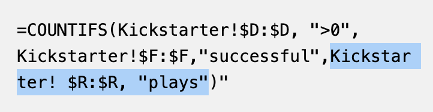
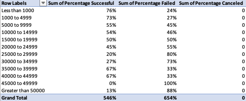

# Kickstarting with Excel

## Overview of Project

### Louise is in the process of producing her play "Fever" and has sought all of her funding for her play through a kickstarter campaign. At the conclusion of her kickstarter, she came close to the goal she set and did so in a relatively short amount of time. In order to gain more insight as to how her kickstarter performed in comparison to other kickstarters for plays, we provided an analysis of other kickstarters' performance in relation to their launch date and goal.  Louise can now use this analysis to better measure her own kickstarter's success and plan more effectively for other kickstarters for plays in the future.

## Analysis and Challenges

### Analysis of Outcomes Based on Launch Date

This project calls for two measurables to be analyzed: a kickstarter's outcome based on its launch date and a kickstarter's outcome based on its monetary goal.  I started by creating a pivot table from the kickstarter data provided to show how the relationship between a kickstarter's launch date impacted its outcome.  Once the pivot table was established I took that data and created a pivot chart in order to better visualize what months had the most and least successful kickstarter campaigns.  

The pivot table needed to show only theater kickstarters, the months when the kickstarters launched, and the number of successful, failed, and canceled Kickstarters in descending order. Focusing on just theater kickstarters helps provide Louise with a better visulization and analysis that is specific to the types of kickstarters she will most likely be producing throughout her career of producing plays. In order to make sure only theater kickstarters were being analyzed in the pivot chart, the parent category was added as a filter so that all data not pertaining to theater kickstarters could be filtered out.  In addition, "Years" was added to the filters to update the table so that just the months of a calendar year were viewed instead of the actual launch dates of the kickstarters.  This positively impacted the analysis results provided to Louise by ensuring non-theater data is removed, reducing the ability of non-pertinent data to skew the results.

Making sure that the pivot chart and table show the month and identify the number of a particular outcome within each month, will help Louise draw stronger conclusions regarding the start date for future kickstarters. For the axis of the pivot chart and table, the "Date Created Conversion" field was added to update the row labels.  Then by deselecting the "Quarters" and "Years2" fields, the months within a calendar year populate as the row labels- allowing a better visualization of how many of a particular outcome occurred within each month as a year progresses based off of the data set.  

It can now be clearly seen which months are ideal to launch KickStarter campaigns and those that are not.

After placing the "outcomes" field in both the "legend" and the "values" pivot chart fields, the pivot table was then updated so that the column labels are viewed in descending order.  Updating the order of the columns in this manner makes the "successful" outcome first and in doing so, a clearer visualization comparing successful versus failed outcomes is acheieved.  Finally, formatting the pivot chart as a line chart with markers optimizes the ability to visualize kickstarter outcomes based on launch dates.  

### Analysis of Outcomes Based on Goals

Regarding the analysis of the relationship between the outcome of a kickstarter and its goal, data was pulled from the orignal data set into a new worksheet that counts the number of each outcome within a goal range and the percentage of the type of outcome within the goal range.  The new worksheet was created and formatted so that there were eight columns each labeled: Goal, Number Successful, Number Failed, Number Canceled, Total Projects, Percentage Successful, Percentage Failed, and Percentage Canceled.  In the Goal column the ranges for the KickStarter goals starting at "Less Than 1000" and ending at "Greater Than 50000," the rows in between were goal ranges that increased in increments of 5000.  Creating these goal ranges helps to better organize all of the varying goal values within the initial data set.  

The "COUNTIFS" formula was implemented to pull and total  all of the particular outcomes asssociated with  the aforementioned goal ranges.  Utilizing this excel function significantly increased efficiency when compiling these totals, which would have otherwise been a manual chore to say the least.  This formula: =COUNTIFS(Kickstarter!D:D, ">0", Kickstarter!F:F,"successful",Kickstarter! R:R, "plays"), 
was used (updated depending on the outcome and goal range needed to be counted) in order to insure that all outcomes that met the criteria were counted.  If this total matched the total from all of the ranges for the type of outcome, it is certain that all pertinent kickstarters were accurately counted.  The last portion of the COUNTIFS formula that was used,, only counted kickstarters with the subcategory of plays, providing a more accurate representation of kickstarters that are most similar to those that Louise would plan in the future.  

Once all of the kickstarters were accurately counted for each type of outcome and goal range, the total number of KickStarters for each goal range was calcuated by using 
    =SUM(B2:D2) 
to total all of the kickstarters for each goal range in the "Total Projects" column.  This new column of totals was then used to calculate the percentage each outcome type contributed to the total number of kickstarters.  Using this formula, 

provided the percentage contribution of each outcome to the total needed to better analyze how a kickstarters goal correlates to its outcome.

After all of the kickstarter data was counted, totaled, and the percent contribution determined in the seperate wokrsheet, a pivot chart and table were created with this new data set.  By assigning the "Goal" field to the axis, the "Sum of Percentage" field for each outcome to values, and the "Values" field to the legend- the percentage contribution for each type of outcome relating to the goal ranges are more easily analyzed by comparing the type of outcome against the other.  Formatting the pivot chart as a line chart provides the best visual representation of the relationship between a kickstarter's outcome and its goal.  Analyzing this pivot chart allows conclusions to be more easily made regarding the similarties and differences that each outcome type has to a particular goal range and outcome.   

### Challenges and Difficulties Encountered

When working on the visualization for the analysis of a kickstarter's outcome based on its launch date, formatting the table and chart to show the launch dates in months was the most challenging.  After a bit of time and tinkering with the pivot chart fields, I realized that selecting the "Years" field name and deselecting the "Quarters" and "Years2" field name resolved this issue.  

With regards to the data compiled to analyze how a kickstarter's outcome relates to its goal, I had complications arise with the "=COUNTIFS" formula I was using.  Initially, I had written the formulas using "<" and ">" so that the kickstater's within a goal range would be counted.  After this first attempt I double checked that all of the Kickstarters that needed to be counted were indeed counted by using "=COUNTIFS(Kickstarter! D:D, ">0", Kickstarter!F:F, "successful/failed/canceled", Kickstarter!R:R, "plays")." Using this formula showed me that there were some Kickstarters that were not being counted for some of the ranges.  As I dug deeper into this disconnect, I realized that the kickstarters which were not being counted were equal to one of the values of the goal ranges.  Therefore I simply updated my formula to use "<=" and ">=" to include the values that matched exactly to those of the goal ranges.

## Results

### Conclusions about Kickstarter Outcomes based on Launch Date

Using this pivot chart for reference, the best month for Louise to launch a kickstarter that is more likely to be successful would be in either May or June.  111 of the kickstarters launched in May and 100 in June were sucessful.  Though May and June had some of the most failed kickstarters, 52 and 49 respectively, this is still about half of those that were succesful.  In addition, from this pivot chart the least amount of successful kickstarters were ones that began in December.  Therefore, it would unwise for Louise to start a Kickstarter for plays on or close to the month of December.

### Conclusions about Kickstarter Outcomes based on Goals

Focusing on the percentage of successful and failed Kickstarters enables Louise to draw conclusions regarding what goal ranges are most associated with succesful Kickstarters.  When analyzing the percentages from the data set, it can be seen that the ideal goal should not exceed $4999 for a succesful outcome.    Taking it a step further, Louise could set a goal up to $19999 but the liklihood of it being successful drops about 25 percentage points when compared to campaigns with goals at or below $4999.  

### Limitations of the Dataset

When analyzing the dataset for "Outcomes Based on Launch" one limitation is that all "Theater" kickstarter campaigns are part of the dataset.  This includes kickstarters that are not solely for the production of plays, but for other subcategories such as musicals and spaces.  In addition, this dataset includes all Kickstarter campaigns regardless of the country it was launched, and therefore casuses the data to rely upon the country that has had the most kickstarters for plays, which may not be the country that Louise plans on starting her next kickstarter.  

### Additional Suggested Helpful Tables and/or Graphs

One helpful pivot chart and table that could be made from this dataset would be one that analyzes a kickstarter's outcome based on the length of the campaign.  This could be used in conjucntion with the Outcomes Based on Launch Date in order to help Louise not only see the ideal start date but also the ideal length of time she should plan on running the campaign for it to be most likely successful. 

In addition, creating another pivot chart and table from the dataset that analzyes and provides insight to the percent variance of a campaign's goal based off of its outcome.  Implementing a box plot would also be helpful for the datasets associated with the relationshop between a Kickstarter's outcome and its goal, launch, date or length of campaign.  This would help to better see the distribution of this data associated with each topic while also providing more support to the conclusions already drawn about Louise's ideal start date and goal.  

Looking soley at this pivot chart,  without taking this worksheet,  into consideration, might lead to giving Louise conlcusions that are not as stable.   The pivot chart technically shows that the percentage of successful kickstarters at or below a goal of $4999 are very close to those that had goals between $35000 and $44999.  But, the total number of kickstarters within those goal ranges differ drastically.

In summary, the kickstarter dataset utilized in this analysis, though there are some limitations as listed above, does provide an ample amount of data that can be used to answer Louise's questions regarding the planning of future kickstarters.  When planning the launch of her kickstarter she should plan this date to land around May or June and avoid the end of a calendar year.  In addition, her goal for a new kickstarter should not exceed $4999, most kickstarters that had goals beyond this range were unsuccesful.  